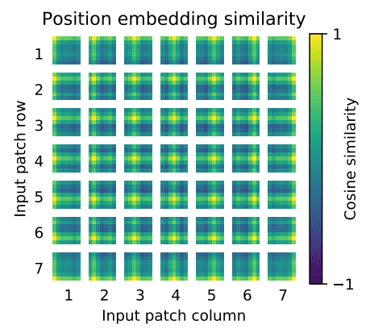

# Vision Transformers ViTs


Uzun yillardir CNN algoritmalari goruntu isleme konularinda neredeyse tek cozumumuzdu. ResNet, EfficientNetm Inception vb. gibi tum mimariler temelde CNN mimarilerini kullanarak goruntu isleme problemlerimizi cozmede bize yardimci oluyor. Bugun sizinle goruntu isleme konusunda farkli bir yaklasim olan ViT'ler yani Vision Transformerlari inceleyecegiz.

Aslinda Transformer kavrami NLP alaninda yurutulen teknolojiler icin ortaya konmustu. Attention is all you need adiyla yayinlanan makale NLP problemlerinin cozumu icin devrimsel cozumler getirdi, artik Transformer-based mimarilar nlp gorevleri icin standart bir hale geldi.

Cok da uzun bir sure gecmeden dogal dil alaninda kullanilan bu mimari goruntu alaninda da ufak degisikliklerle uyarlandi. Bu calismayi ["An image is worth 16x16 words"]() olarak bu linkteki paperdan okuyabilirsiniz. Asagida daha detayli anlatacagim fakat temel olarak bir goruntuyu 16x16 boyutlu parcalara ayirarak embeddinglerini cikartmak uzere. Temel bazi konulari anlatmadan bu mekanikleri aciklamak cok zor bu yuzden hiz kaybetmeden konuyu daha iyi anlamak icin alt basliklara gecelim.

## Attention Mekanizmasi

## Mimari

ViT mimarisi birkaç aşamadan oluşur:

1. **Patch + Position Embedding (inputs)** - Giriş görüntüsünü bir dizi görüntü parcalarina (patches) dönüştürür ve parcalarin hangi sırayla geldiğini bilmek icin bir konum numarası ekler.

2. **Linear projection of flattened patches (Embedded Patches)** - Görüntü parcalari embeddinglere dönüşür, görüntüleri direkt kullanmak yerine embeddingleri kullanmanın yararı, embeddingler görüntünün eğitimle öğrenilebilir bir temsili olmasıdır.

3. **Norm** - Bir sinir ağını düzenli hale getirmek (overfitting'i azaltmak) için bir teknik olan "Layer Normalization" veya "LayerNorm"un kısaltmasıdır.

4. **Multi-Head Attention** - Bu, Multi-Headed Self-Attention layer veya kısaca "MSA" dır.

5. **MLP (Multilayer perceptron)** - Genellikle herhangi bir ileri besleme katmanı koleksiyonunu olarak dusunebilirsiniz.

6. **Transformer Encoder** - Transformer Encoder, yukarıda listelenen katmanların bir koleksiyonudur. Transformer Encoderin içinde iki atlama (skip) bağlantısı vardır ("+" sembolleri), katmanın girdilerinin doğrudan sonraki katmanların yanı sıra hemen sonraki katmanlara beslendiği anlamına gelir. Genel ViT mimarisi, birbiri üzerine yığılmış bir dizi Transformer kodlayıcıdan oluşur.

7. **MLP Head** - Bu, mimarinin çıktı katmanıdır, bir girdinin öğrenilen özelliklerini bir sınıf çıktısına dönüştürür. Görüntü sınıflandırması üzerinde çalıştığımız için buna "sınıflandırıcı kafa" da diyebilirsiniz. MLP Kafasının yapısı MLP bloğuna benzer.


### Patch Embeddings

Standart Transformer, girişi tek boyutlu token embedding dizisi olarak alır. 2B görüntüleri işlemek için **x∈R^{H×W×C}** görüntüsünü düzleştirilmiş 2B patchlere (goruntu parcalarina) yeniden şekillendiriyoruz.

Burada, (H, W) orijinal görüntünün çözünürlüğüdür ve (P, P) her görüntü parçasının çözünürlüğüdür. Resim sabit boyutlu parcalara bölünmüştür, aşağıdaki resimde yama boyutu 16×16 olarak alınmıştır. Yani görüntünün boyutları 48×48 olacaktır.

Self-attention maliyeti quadratictir. Görüntünün her pikselini girdi olarak iletirsek, Self-attention her pikselin diğer tüm piksellerle ilgilenmesini gerektirir. Self-attention ikinci dereceden maliyeti çok maliyetli olacak ve gerçekçi girdi boyutuna ölçeklenmeyecek; bu nedenle, görüntü parcalara bölünür.

```python
import matplotlib.pyplot as plt
from PIL import Image
import numpy as np
```

```python
img = Image.open('cobanov-profile.jpg')
img.thumbnail((224, 224))
array_img = np.array(img)
array_img.shape
```

```python
# Setup hyperparameters and make sure img_size and patch_size are compatible
img_size = 224
patch_size = 16
num_patches = img_size/patch_size 
assert img_size % patch_size == 0, "Image size must be divisible by patch size" 
print(f"Number of patches per row: {num_patches}\
        \nNumber of patches per column: {num_patches}\
        \nTotal patches: {num_patches*num_patches}\
        \nPatch size: {patch_size} pixels x {patch_size} pixels")

```

```python
# Create a series of subplots
fig, axs = plt.subplots(nrows=img_size // patch_size, # need int not float
                        ncols=img_size // patch_size, 
                        figsize=(num_patches, num_patches),
                        sharex=True,
                        sharey=True)

# Loop through height and width of image
for i, patch_height in enumerate(range(0, img_size, patch_size)): # iterate through height
    for j, patch_width in enumerate(range(0, img_size, patch_size)): # iterate through width

        # Plot the permuted image patch (image_permuted -> (Height, Width, Color Channels))
        axs[i, j].imshow(array_img[patch_height:patch_height+patch_size, # iterate through height 
                                        patch_width:patch_width+patch_size, # iterate through width
                                        :]) # get all color channels

        # Set up label information, remove the ticks for clarity and set labels to outside
        axs[i, j].set_ylabel(i+1, 
                             rotation="horizontal", 
                             horizontalalignment="right", 
                             verticalalignment="center") 
        axs[i, j].set_xlabel(j+1) 
        axs[i, j].set_xticks([])
        axs[i, j].set_yticks([])
        axs[i, j].label_outer()

# Set a super title
plt.show()
```


## Linear Projection of Flattened Patches

Parcalar Transformer bloğuna geçirmeden önce, makalenin yazarları yamaları önce doğrusal bir projeksiyondan geçirmeyi faydalı buldular. Bir yamayı alıp büyük bir vektöre açarlar ve yamalı gömmeler oluşturmak için gömme matrisiyle çarparlar ve bu, konumsal gömmeyle birlikte transformatöre giden şeydir.

Her yama, tüm piksel kanallarını bir yamada birleştirerek ve ardından bunu doğrusal olarak istenen giriş boyutuna yansıtarak gömülen bir 1B yamaya düzleştirilir.

## Positional embeddings

Nasil konusurken dilde kelimelerin sırası kurdugunuz cumlenin anlamini tamamen degistiriyorsa, goruntuler uzerinde de buna dikkat etmek gerekir. Maalesef transformerlar, patch embeddinglerin "sırasını" dikkate alan herhangi bir varsayılan mekanizmaya sahip değildir.

Bir yapboz yaptiginizi dusunun, elinizdeki parcalar (yani onceki adimlarda yaptigimiz patch embeddingler) karisik bir duzende geldiginde goruntunun tamaminda ne oldugunu anlamak oldukca zordur, bu transformatörler için de geçerli. Modelin yapboz parçalarının sırasını veya konumunu çıkarmasını sağlamanın bir yoluna ihtiyacımız var.

Transformatörler, giriş elemanlarının yapısından bağımsızdır. Her yamaya öğrenilebilir konum yerleştirmeleri eklemek, modelin görüntünün yapısı hakkında bilgi edinmesine olanak tanır. Positional embeddinglerde düzeni modele aktarmamizi sagliyor. ViT için, bu Positional embeddingler, patch embeddingler ile aynı boyutluluğa sahip öğrenilmiş vektörlerdir.

Bu konumsal yerleştirmeler, ön eğitim sırasında ve (bazen) ince ayar sırasında öğrenilir. Eğitim sırasında, bu yerleştirmeler, özellikle aynı sütunu ve satırı paylaşan komşu konum yerleştirmelerine yüksek benzerlik gösterdikleri vektör uzaylarında birleşir.



## Transformer Encoding

- **Multi-Head Self Attention Layer(MSP)** birden fazla attention ciktisini lineer olarak beklenen boyutlara esitlemek için kullanilir. MSP, görüntüdeki yerel ve global bağımlılıkları öğrenmeye yardımcı olur.

- **Multi-Layer Perceptrons(MLP)** - Klasik sinir agi katmani fakat aktivasyon fonksiyonu olarak GELU kullaniyoruz.

- **Layer Norm(LN)** eğitim görüntüleri arasında herhangi bir yeni bağımlılık getirmediğinden her bloktan önce uygulanır. Eğitim süresini ve genelleme performansını iyileştirmeye yardımcı olun.

- **Residual connections** gradyanların doğrusal olmayan aktivasyonlardan geçmeden doğrudan ağ üzerinden akmasına izin verdiği için her bloktan sonra uygulanır.
Görüntü sınıflandırması için, ön eğitim zamanında bir gizli katman ve ince ayar için tek bir doğrusal katman ile MLP kullanılarak bir sınıflandırma kafası uygulanır. ViT'nin üst katmanları global özellikleri öğrenirken, alt katmanlar hem global hem de yerel özellikleri öğrenir. Bu, ViT'nin daha genel kalıpları öğrenmesini sağlar.

## Egitim

ViT, büyük veri kümelerinde önceden eğitilmiştir ve daha küçük bir veri kümesine ince ayar yapılmıştır.

İnce ayar yapılırken, önceden eğitilmiş son tahmin kafası kaldırılır ve daha küçük veri kümesine dayalı olarak sınıfları tahmin etmek için sıfır başlatılmış bir ileri besleme katmanı ekleriz.

İnce ayar, modelin önceden eğitildiğinden daha yüksek çözünürlüklü bir görüntüye uygulanabilir, ancak yama boyutu aynı kalmalıdır.

Transformers, görüntü yapısı hakkında önceden bilgiye sahip değildir ve bu nedenle daha uzun eğitim sürelerine sahiptir ve modeli eğitmek için büyük veri kümeleri gerektirir.

## Sources

- <https://www.learnpytorch.io/08_pytorch_paper_replicating/#3-replicating-the-vit-paper-an-overview>
- <https://theaisummer.com/vision-transformer/>
- <https://medium.com/swlh/visual-transformers-a-new-computer-vision-paradigm-aa78c2a2ccf2>
