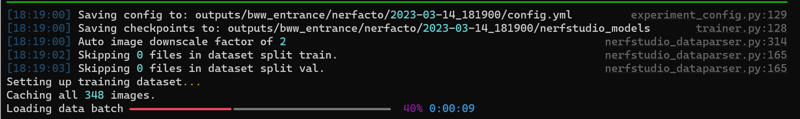

# NeRF Docker Setup

## Prerequisites

1. Docker
2. Latest nvidia drivers
3. CUDA 11.8 capable GPU

## Install

1. Pull latest docker image

```bash
docker pull dromni/nerfstudio:<version_number>
```

You can see the latest tag in this link <https://hub.docker.com/r/dromni/nerfstudio/tags>

```bash
# example command
docker pull dromni/nerfstudio:0.1.19
```

2. Run docker image

```bash
docker run --gpus all -v /folder/of/your/data:/workspace/ -v /home/<YOUR_USER>/cache/:/home/user/.cache/ -p 7007:7007 --rm -it dromni/nerfstudio:0.1.13
```

Example for Windows:

```bash
docker run --gpus all -v D:\nerf:/workspace/ -v D:\nerf/:/home/user/.cache/ -p 7007:7007 --rm -it dromni/nerfstudio:0.1.19
```

```
-  Give the container access to nvidia GPU (required).
-  Mount a folder from the local machine into the container to be able to process them (required).
-  Mount cache folder to avoid re-downloading of models everytime (recommended).
-  Map port from local machine to docker container (required to access the web interface UI).
-  Remove container after it is closed (recommended).
-  Start container in interactive mode.
-  Docker image name
```

## Training First Model

### Don't forget to change the directory

```
cd /workspace
```

Be sure to do everything you do after this point in the `/workspace` directory.

### Start Training

```
ns-download-data nerfstudio --capture-name=poster
```

Because this code is often used too much, google drive can put a download restriction, read the error message and try to download the file in the link with your browser.

There are also different dataset you can use, to show them run this code

```bash
ns-download-data nerfstudio --help
```

```plain
bww_entrance, campanile, desolation, library, 
poster, redwoods2, storefront, vegetation, Egypt, 
person, kitchen, plane, dozer, floating-tree, aspen, 
stump, sculpture, Giannini-Hall, all, nerfstudio-dataset
```

After select one of the dataset you can download as well with following command

```
ns-download-data nerfstudio --capture-name=bmw_entrance
```

You will see all the downloaded datasets in this directory `D:\nerf\data\nerfstudio`

### Explore NeRF Studio

Start training with the following command, you will need change the datapath to your dataset folder

```bash
ns-train nerfacto --data data/nerfstudio/poster
```

or

```bash
ns-train nerfacto --data data/nerfstudio/bww_entrance
```

If everything is correct, ideal output would be like this.



A web page similar to the link below will appear on your terminal screen, open this page and continue.

```bash
https://viewer.nerf.studio/versions/22-12-02-0/?websocket_url=ws://localhost:7007 
```

### Resume & Stop Training

You can stop the training with the `Ctrl + c` shortcut.

If you want to continue the training from where it left off, run the code below.

```bash
ns-train nerfacto --data data/nerfstudio/poster --load-dir {outputs/.../nerfstudio_models}
```

Example code

```bash
ns-train nerfacto --data data/nerfstudio/bww_entrance/ --load-dir outputs/bww_entrance/nerfacto/2023-03-14_183456/nerfstudio_models/
```

### Visualize Only (without training)

```bash
ns-viewer --load-config {outputs/.../config.yml}
```

```bash
# example code
ns-viewer --load-config outputs/bww_entrance/nerfacto/2023-03-14_183456/config.yml
```

## Training on Custom Data

Put your files in the main directory of the volume you opened, you can also keep them in a folder in the main directory.

```bash
ns-process-data {video,images,polycam,insta360,record3d} --data {DATA_PATH} --output-dir {PROCESSED_DATA_DIR}
```

```bash
# example code
ns-process-data video --data raw_video/forest_walk.mp4 --output-dir forest_walk_processed
```

Arguments:

```
ns-process-data images [-h] --data PATH --output-dir PATH
                       [--camera-type {perspective,fisheye}]
                       [--matching-method {exhaustive,sequential,vocab_tree}]
                       [--sfm-tool {any,colmap,hloc}]
                       [--feature-type 
{any,sift,superpoint,superpoint_aachen,superpoint_max,superpoint_inloc,r2d2,d2
net-ss,sosnet,disk}]
                       [--matcher-type 
{any,NN,superglue,superglue-fast,NN-superpoint,NN-ratio,NN-mutual,adalam}]
                       [--num-downscales INT] [--skip-colmap]
                       [--colmap-cmd STR] [--no-gpu] [--verbose]
```

```bash
ns-train nerfacto --data {PROCESSED_DATA_DIR}
```

```bash
# example code
ns-train nerfacto --data forest_walk_processed/
```

### Example

It points to the same place in the following two paths. one its location on the host and the other its location inside the container.

Raw File Path:

- `D:\nerf\raw_data\IMG_6070.MOV`
- `/workspace/raw_data/IMG_6070.MOV`

Target Folder Path:

- `D:\nerf\outputs\test_video`
- `/workspace/outputs/bank`

Preparing

```bash
ns-process-data video --data /workspace/raw_data/IMG_6070.MOV --output-dir /workspace/outputs/bank
```

Training

```bash
ns-train nerfacto --data outputs/bank
```

## KIRI Engine

Coming soon...
